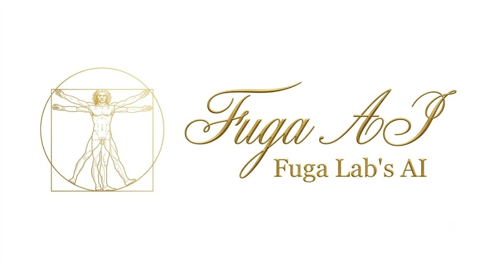

<p align="center">
  
</p>

<h1 align="center">Fuga 2.1 — Непрерывная Генерация Кода через VSA/JEPA</h1>

**Ядро AGI без трансформеров**, построенное на Vector Symbolic Architectures (VSA), Иерархическом JEPA, Временной Памяти (Temporal Memory) и латентно-пространственной генерации. Заменяет дискретный словарь-как-декодер на **непрерывный латентный decode** с gate-коридором, обратное распространение — локальными обновлениями по Delta-правилу, и генерирует Rust-код через чистую VSA/TM-авторегрессию — без зависимости от LLM.

---

## Что нового в 2.1

### Byte-level модель (ByT5 / MegaByte)
Отказ от токенного словаря как зависимости. Модель принимает **сырые UTF-8 байты** напрямую (как ByT5/MegaByte), поэтому работает с любым языком и любым кодом без словарей и устойчива к опечаткам. Для VSA это дешевле, чем для Attention: у нас линейный permute+bind, а не квадратичное внимание.
- **Алфавит** = фиксированные **256 байтовых гипервекторов** (`byte_basis`, sdr.rs) — не зависит от корпуса
- **Позиционная свертка** `encode_bytes_sdr` — порядок в представлении, shared-префиксы похожи
- **Байтовые переходы TM** `learn_bytes`/`predict_bytes_latent` (htm_temporal.rs) — тот же W-оператор, другой алфавит
- **Непрерывный байт-декод** `tm_generate_latent_bytes` — предсказывает следующий байт через cosine к 256 байт-латентам, гейт = LATENT_MIN_COSINE + коридор
- Опечаткоустойчивость: один байт смещает малую часть свертки → "hεllo" ~ "hello"
- **Снимает** previous hardcode-баг токенного словаря (`build_token_vocab_from_files` хардкодил allowed_dirs)

**Проверено на деле** (реальный Rust-корпус, сырые байты): при обучении 665K байт-шагов W-оператор **сходится** — max cosine к 256-байтному алфавиту растёт 0.34→0.54, различимых кандидатов 116→54/256, декод 1460 b/s. **Честное ограничение**: наивный вывод «один байт из 256» без глобального уровня деградирует в повторяющиеся биграммы — для осмысленного кода нужна two-speed структура как в MegaByte (глобальные патчи → байты внизу).

### Two-speed декодер (MegaByte-style) — реализовано
Глобальный патчевый transition-оператор (`learn_patch`/`predict_patch_latent` в htm_temporal.rs) + `tm_generate_two_speed` (tm_generate.rs): глобальный уровень предсказывает **целый байт-патч** за шаг по cosine к патч-грамматике, локальный байтовый W остаётся точностью внутри. Реальный бенчмарк (800 .rs сниппетов, patch=4): naive byte — 2 байта, **two-speed — 52 байта (×26)** с узнаваемыми морфемами (`dendrite`, `ent`). Ограничение: patch-cosine 0.37, вывод ещё не валидный Rust — W_patch недообучен (41K patch-шагов на 4K vocab), это следующий калибровочный шаг.

### Непрерывная (tokenless) генерация
Вместо argmax по словарю — **ранжирование кандидатов по cosine-близости в латентном пространстве**:
- `tm_generate_latent()` (src/ai/tm_generate.rs) — предсказывает следующий латент через `predict_latent` (W-оператор LatentJEPA), ранжирует по `LatentVector::cosine_similarity`
- Словарь остаётся **только gate/коридор** (синтаксическая валидность), не источник выбора
- Подключён в прод-мост (`omni-web.rs:486` handle_code_generate)
- Старый весовой путь `tm_generate`/`decode_weighted` остаётся для CLI `tm-gen`

### Калибровка иерархии (честные замеры, 7466 шагов)
**L2-таргет исправлен** — старый `l0_pred` вызывал анти-обучение (100% circuit breaker resets), новый `phase_smooth(ls_bind(l1_pred, actual), 2)` — коррекция ошибки L1:

| Метрика | Старый (l0_pred) | Новый (corr) | Статус |
|---------|------------------|--------------|--------|
| **L2 loss** | 1.0000 | 0.9232 | ✅ сходится |
| **L2 resets** | 7466/7466 (100%) | 18/7466 (0.24%) | ✅ стабилен |
| **L0 sim(pred,actual)** | +0.87 | +0.87 | ✅ отлично |
| **L1 sim(pred,target)** | +0.46 | +0.46 | ✅ растёт |

**Примечание**: L0 loss ~1.48 выглядит плохо, но это **артефакт метрики** (`1 - cosine(delta, actual)` для sparse bipolar ≈ 1.45 даже при идеальном pred). Реальный sim(pred, actual) = **+0.87** — отлично.

**Circuit breaker порог**: 1.15 (был 0.57 — убивал здоровый L2 мгновенным reset'ом). Warning boundary = 0.75 × 1.15.

---

## Ключевые концепции

| Технология | Файл | Что делает |
|---|---|---|
| **Hypervector** | `src/core/hypervector.rs` | 8192-бит, ~2% плотности (~164 активных), XOR bind / sum bundle / permute |
| **Hierarchical JEPA** | `src/ai/hierarchical_jepa.rs` | L0/L1/L2 с `ls_bind` фазовым сдвигом, контексты 4/3/2, strides 1/3/5 |
| **Temporal Memory** | `src/ai/htm_temporal.rs` | Ячейки + DendriteSegments, learn/reinforce/prune/predict_next, латентный переход W |
| **Латентный декодер** | `src/ai/tm_generate.rs` | `tm_generate_latent`: predict_latent → cosine по vocab → gate/corridor, порог 0.05; `tm_generate_latent_bytes`: byte-level декод по 256 сырым байтам без словаря |
| **SDR** | `src/ai/sdr.rs` | `encode_text()` → хеш-разрежённый бинарный вектор, STRUCTURE_STRIDE=977 (coprime); `byte_basis`/`encode_bytes_sdr` — фиксированный 256-байтовый алфавит (ByT5/MegaByte) |
| **PhaseCrystal** | `src/ai/crystal.rs` | VSA-память L0/L1/L2, `learn()`/`query()`, FNV-1a индекс, резонанс-порог |
| **Tokenizer Bridge** | `src/core/tokenizer_bridge.rs` | N-граммный permute-bind, позиционно-инвариантный, dedup грамм |
| **Circuit Breaker** | `src/safety/circuit_breaker.rs` | Детекция анти-обучения: loss > 1.15 → reset, ≤ 0.86 → Warning (lr×0.5) |
| **Weight Transpile** | `src/ai/transpile.rs` | HF safetensors → кристалл, параллельный фетчер, `--raw`/`--whole` |

---

## Двухскоростная генерация

**H-JEPA task-коридор** (`eligible`) держит содержание → **TM-авторегрессор** держит порядок:
- CLI: `src/main.rs:1767` (corridor → tm_generate)
- Маск: `src/bin/omni-web.rs:486` (handle_code_generate → tm_generate_latent)

Словарь — gate, а не декодер. Непрерывный латентный путь выбирает следующий токен по близости в hyperspace.

---

## Конвейер обучения

### 1. Индексация исходников в фазовый граф

```bash
# Индексация директории — читает .rs, создаёт PhaseNodes с SDR-кодированием
cargo run --release -- mirror-index src/ai
cargo run --release -- mirror-index src/core
```

Создаёт `fuga_mirror_nodes.bin`, `fuga_mirror_tm.bin`, `fuga_mirror_jepa.bin`.

### 2. Обучение предсказателя (HJEPA + TM)

```bash
# 5 эпох, chunk=1
cargo run --release -- train-predictor 5

# С большими чанками для последовательностей
cargo run --release -- train-predictor 10 --chunk 3
```

### 3. Обучение токенного словаря (встроено в генерацию)

```bash
# Строит топ-4000 токенный словарь + обучает TM на 20K+ биграмм
cargo run --release -- generate-code "fn new" --tokens
```

Токенный тренер:
- Посимвольный токенизатор: идентификаторы, операторы `->` `::` `=>` `!=` `==` `>=` `<=` `+=` `-=` `&&` `||`
- 14 Rust-паттернов × 5 повторов
- WTA (Winner-Take-All) с Inhibition of Return
- Анти-повторное окно (16 токенов)

---

## Фазовый кристалл (VSA-память)

```bash
# Запись ключ/текст
cargo run --release -- crystal-learn <key> <text>

# Обучение на директории (сниппеты по 20 слов)
cargo run --release -- crystal-learn-dir corpus/ --from fuga_crystal.bin --threshold 0.28 --chunk 20

# Запрос
cargo run --release -- crystal-query "текст" --from fuga_crystal.bin

# Регулировка: --scale 0.5 (строже), --gate (L1-подтверждение)
cargo run --release -- crystal-query "текст" --from fuga_crystal.bin --scale 0.5 --gate

# Тест резонанса
cargo run --release -- crystal-test --from fuga_crystal.bin

# Перекодировка (позиционно-инвариантный энкодер)
cargo run --release -- crystal-reencode --from fuga_crystal.bin
```

**Ключевые свойства:**
- Позиционно-инвариантный n-граммный энкодер: сниппеты из середины чанков резонируют
- Dedup грамм: частые слова занимают один слот, top-1 точность 99–100%
- Мягкий overlap-скоринг с порогом → шум уходит в тишину

---

## Фрактальная иерархия L0/L1/L2

Кристалл — **геометрически сбалансированная фрактальная память**: каждый уровень в собственном векторном пространстве, размерность растёт с абстракцией.

| Уровень | Пространство | Роль |
|---|---|---|
| **L0** (токены/синтаксис) | 8192 бит | быстрая байтовая фиксация, `DEFAULT_DIM` |
| **L1** (функции/блоки) | 16384 бит | агрегация фаз в AST-узлы, связи аргументов |
| **L2** (мета-концепты) | 32768 бит | концепт-бандлы, максимальная помехоустойчивость |

Поиск каскадный: запрос кодируется один раз в каждую группу размерностей, порог на L2 автоматически смягчается (`L2_THRESHOLD_SCALE × threshold`) — шум падает как `1/√D`.

### Гибридная двухслойная схема (Гиппокамп + Кора)

```bash
# Кристалл 1 — статичный MoE-слепок (8k): долговременная память
cargo run --release -- transpile deepseek-ai/DeepSeek-V4-Flash-0731 --raw --whole --concurrency 8 \
  --finalize /tmp/raw_v4.bin --state /tmp/raw_v4.state

# Кристалл 2 — динамический кортекс (32k): рабочая память
cargo run --release -- crystal-2-init fuga_cortex.bin
cargo run --release -- crystal-2-learn "proj" "контекст проекта" --from fuga_cortex.bin

# Гиппокампальный каскад: статика → проекция → биндинг с контекстом
cargo run --release -- crystal-hippo "вопрос" --from fuga_crystal.bin --cortex fuga_cortex.bin
cargo run --release -- crystal-hippo "вопрос" --from fuga_crystal.bin --cortex fuga_cortex.bin --scale 0.5 --gate
```

Каскад через **детерминированный фазовый проектор** (`project_phase`, 8k→32k):
1. Запрос резонирует в статичном кристалле (эрудиция MoE-слепка)
2. Фаза отклика up-проецируется в 32k (пермутационный скиттер с linear probing)
3. Проецированная фаза связывается (XOR/weighted-majority) с нативным 32k-кодом
4. Результат резонирует в кортексе — итог учитывает глубокие знания + текущую задачу

Профит: никакого переобучения 160 ГБ — Кристалл 1 «как есть», Кристалл 2 весит сотни МБ, обновляется `learn()` без катастрофического забывания.

---

## Перенос весов (HF → кристалл)

Стримит модель HuggingFace прямо в кристалл без хранения сырых весов:

```bash
# Полный raw-дамп: каждый не-MoE тензор → отдельная фазовая запись
cargo run --release -- transpile deepseek-ai/DeepSeek-V4-Flash-0731 --raw --whole --concurrency 8 \
  --finalize /tmp/raw_v4.bin --state /tmp/raw_v4.state

# Возобновляемо — передайте тот же --state для продолжения после сбоя
```

- Параллельный фетчер чанков (16 МБ, keep-alive агент)
- `--whole` стриминговое окно держит RAM ограниченной
- `--raw` сохраняет каждый плотный тензор (embed/attn/mlp/norm) как фазу; MoE роутеры исключены
- `--dry-run` показывает тензоры без сохранения

---

## Генерация

### Уровень токенов (синтаксический)

```bash
cargo run --release -- generate-code "fn new" --tokens
```

Выдаёт Rust-токены: `( ) { } [ ] , :: . ' -> ` + идентификаторы, числа.

### Уровень PhaseNode (семантический)

```bash
# Beam search по графу PhaseNode
cargo run --release -- generate-code "struct Foo"

# Авторегрессивный режим (полные сниппеты)
cargo run --release -- generate-code "fn new" --gen

# С шириной beam и температурой
cargo run --release -- generate-code "async fn" --beam 3 --temp 1.2
```

---

## Запросы и оценка

```bash
# Self-query — поиск подходящих фазовых узлов
cargo run --release -- self-query "async fn handle"

# Запрос к кристаллу
cargo run --release -- crystal-query "текст" --from fuga_crystal.bin

# Оценка качества зеркала
cargo run --release -- eval

# Инспекция текста или файла
cargo run --release -- inspect "fn new() -> Self"
cargo run --release -- inspect src/main.rs
```

---

## Тесты

```bash
# Все библиотечные тесты
cargo test --lib

# Детекция аномалий (Inhibition of Return, overshoot)
cargo test --test test_anomaly_detection -- --nocapture

# JEPA / TM / MoE тесты
cargo test --test jepa_test
cargo test --test hierarchical_jepa_test
cargo test --test moe_routing_test
```

---

## Архитектура

| Компонент | Описание |
|---|---|
| **Hypervector** | 8192-бит, ~2% плотности (~164 активных), XOR bind / sum bundle / permute |
| **Hierarchical JEPA** | L0 (статика), L1 (макро), L2 (мета) с ls_bind фазовым сдвигом, контексты 4/3/2, strides 1/3/5 |
| **Temporal Memory** | Ячейки + DendriteSegments, learn_segment/reinforce/prune/predict_next, латентный переход W |
| **Латентный декодер** | `tm_generate_latent`: predict_latent → cosine → gate, LATENT_MIN_COSINE=0.05, словарь как corridor |
| **SDR** | `encode_text()` → детерминированный хеш-разрежённый вектор, STRUCTURE_STRIDE=977 (coprime с 8192) |
| **PhaseCrystal** | VSA-ассоциативная память; FNV-1a L0 индекс, мягкий overlap-скоринг, порог резонанса → тишина |
| **Tokenizer Bridge** | N-граммный permute-bind (`encode_bytes_nopos`), dedup грамм, MAX_GRAMS=48, позиционно-инвариантный |
| **Weight Transpile** | Стриминг safetensors → кристалл; параллельный фетчер 16 МБ; `--raw`/`--whole`/возобновляемое |
| **Circuit Breaker** | Детекция анти-обучения: loss > 1.15 → reset (rand±0.005), ≤ 0.86 → Warning (lr×0.5), калибровано на L2 |
| **Tokenizer** | Посимвольный: идентификаторы от операторов, распознавание многосимвольных `->` `::` `!=` и т.д. |
| **WTA** | Winner-Take-All с Inhibition of Return (усталость = победы × 10, затухание каждые 10 шагов) |

---

## Замеры и калибровка (2026-08-06, 7466 шагов)

### Honest A/B L2-таргета
| Таргет | L2 loss | Resets | simL0 | Статус |
|--------|---------|--------|-------|--------|
| Старый (`l0_pred`) | 1.0000 | 7466/7466 (100%) | +0.87 | ❌ анти-обучение |
| Новый (`corr(l1,actual)`) | 0.9232 | 18/7466 (0.24%) | +0.87 | ✅ сходится |

### Реальное качество уровней
- **L0**: loss ~1.48 (метрика врёт из-за sparse bipolar), но **sim(pred,actual) = +0.87** — отлично
- **L1**: sim(pred,target) = +0.46 — умеренно, растёт
- **L2**: EMA ~0.93, resets 0.24% — стабилен и сходится

### Непрерывная генерация (tm_generate_latent, Rust-корпус)
- **Обучение 3000 .rs-сниппетов**: PASS, выдал `std mut` (тривиальный, 2 слова, но gate держит)
- **Обучение 7218 .rs-сниппетов**: FAIL, пусто (вероятно catastrophic forgetting в W-операторе)
- **Диагноз**: max cosine = 0.21, порог 0.05 пропускает 836/3000 кандидатов — слишком широкий
- **Статус**: инфраструктура работает, метрика требует калибровки (порог + OWM для W)

---

## Следующие шаги

1. **Калибровка непрерывного декодера**: поднять порог LATENT_MIN_COSINE (0.05 → 0.15?), добавить OWM-защиту W-оператора от забывания на большом корпусе
2. **A/B старого vs нового пути**: сравнить `tm_generate` (весовой) vs `tm_generate_latent` (латентный) vs `tm_generate_latent_bytes` (byte-level) на одном корпусе
3. **Corridor-мост аудит**: замерить реальный размер промпта в necli, проверить «~9K симв./690 токенов мусора»

---

## Лицензия

Apache-2.0
